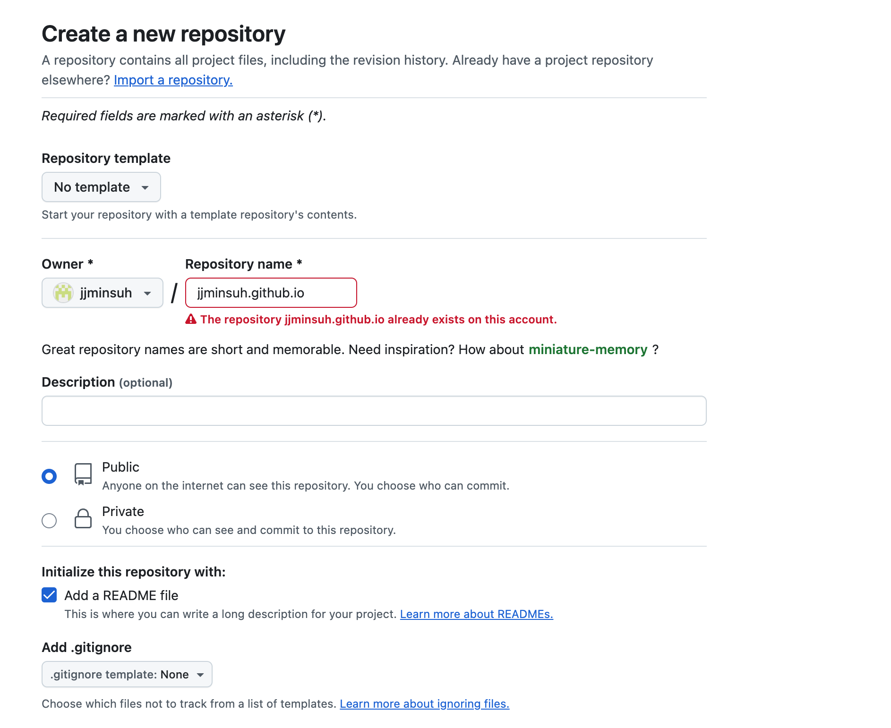
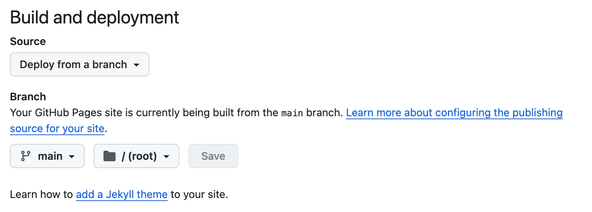
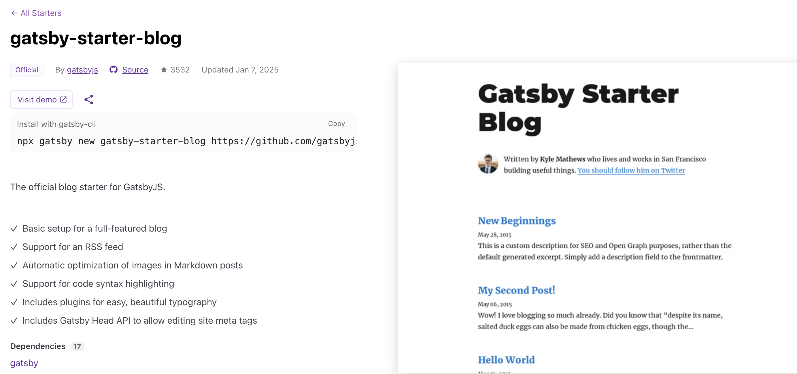
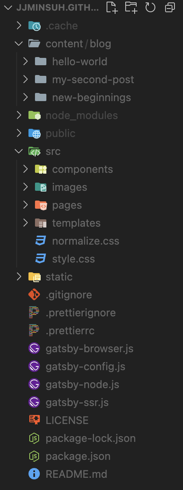
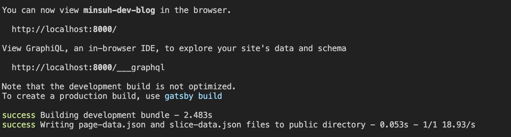
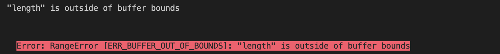

언젠간 개발 블로그를 하나 만들어서 기록을 해야겠다는 다짐을 했었는데, 올해 첫 목표로 한 번 도전해보기로 했습니다.

어떤 플랫폼을 활용할까 고민해보다가 뭔가 제가 직접 커스텀 해보고 싶다는 생각이 들었고 Git Pages 활용해서 웹 호스팅을 하고 블로그를 올리기로 마음먹었습니다.

깃 블로그 관련 자료를 찾아보다보니까 대부분 jekyll로 블로그를 만드는 걸 보고 나도 이렇게 해봐야겠다고 생각하던 중 Gatsby를 발견했습니다. (사실 Ruby를 install하는 도중에 이것저것 검색하다가 발견했습니다.)

특히 올리브영 기술블로그에 있던 아래의 글을 보고 Gatsby에 대해서 알게 되었습니다.

https://oliveyoung.tech/2022-07-04/How-to-Develop-And-Migration-Blog-With-Gatsby/

Gatsby가 React 기반으로 만들어졌다는 점에서 이 프레임워크를 선택해봐야겠다고 생각했습니다. (사유: 제가 React에 익숙했기 때문...)

그래서 결론적으로 제 개발 블로그의 전체적인 구성은

1. Gatsby 프레임워크를 활용해서 블로그 페이지를 만들고
2. Git Pages로 호스팅 하여 배포하는 방식

으로 이루어져 있습니다.

여러 자료를 찾아보면서 우선 아래의 두 블로그를 많이 참고하면서 블로그 페이지를 만들어나갔습니다.

- https://kirahaa.github.io/make-gatsby-blog/
- https://siisee111.medium.com/gatsby-js%EB%A1%9C-%EC%9B%B9%ED%8E%98%EC%9D%B4%EC%A7%80-%EB%A7%8C%EB%93%A4%EA%B8%B0-1-11d5cf3336c6

그럼 이제 이 블로그를 만들어나간 과정을 정리해보도록 하겠습니다.

### Git Pages로 호스팅 할 Repository 만들기
위의 두 블로그는 Gatsby 프로젝트를 먼저 로컬에 만든 후 git repo를 연결하는 방식으로 진행을 했습니다. 하지만 저는 jekyll로 블로그를 만들던 도중 두 블로그를 찾았기 때문에 git repo를 먼저 만들고 clone 한 상태에서 진행해서 순서를 조금 바꿔서 진행을 했습니다.

일단 Github에서 Repository를 만들어야합니다.



New repository를 만들어주고 Repository name 부분에 `githubID.github.io` 형태로 작성해줍니다. (이렇게 작성해주어야 https://jjminsuh.github.io/ 와 같이 본인의 github 아이디를 활용한 블로그 페이지를 만들 수 있습니다.)

저는 이미 해당 repo가 있어서 빨간색이 뜨지만 해당 이름의 repo가 이미 있지 않은 이상 초록색으로 표시되면서 repo를 만들 수 있습니다!

그리고 아래에 확인을 위해 README file을 체크 해줍니다.

다음으로 만들어진 reop에 들어가서 Setting > Pages로 들어가면 아래 사진처럼 branch를 deploy할 수 있는 설정이 있습니다.



Deploy 할 브랜치로 main 브랜치를 설정하고 일단 Save를 하면 상단에 

**Your site is live at https://jjminsuh.github.io/**

형태로 Github Pages에서 내 페이지를 호스팅 하고 있다는 것을 확인할 수 있습니다.

해당 링크로 들어가면 내 리드미가 페이지에 보이는 것을 확인할 수 있습니다!

### Gatsby로 블로그 만들기

이제 Gatsby를 활용해서 블로그를 만들어보려고 합니다.

로컬에서 Gatsby 프로젝트를 만든 후에 해당 파일에 앞서 만든 repo를 연결해도 되고, repo를 clone 한 후에 로컬에서 작업해도 괜찮습니다.

저는 repo를 먼저 로컬에 clone 한 후에 작업을 진행했습니다.

로컬에 repo를 clone하면 내 repo 이름의 폴더가 생기고 그 안에 파일들이 저장됩니다.

이제 해당 폴더에서 Gatsby 프로젝트를 만들어야합니다.

우선 Gatsby를 쓸 수 있도록 gatsby-cli를 install 해줍니다.

터미널에 아래와 같이 입력하여 install 할 수 있습니다.

```bash
npm install -g gatsby-cli 
```

바로 그냥 Gatsby 프로젝트를 만들수도 있지만 블로그를 만들 예정이고, 완전 백지에서 시작하는 것보다 적당한 템플릿을 적용하고 이후에 수정해나가는 것이 더 효율적일 것이라고 생각해서 템플릿을 먼저 찾아봤습니다.

아래 사이트에 들어가면 starter를 위한 다양한 템플릿이 존재합니다.

https://www.gatsbyjs.com/starters/

저는 gatsby-starter-blog를 선택했고, 템플릿 상세 페이지에 들어가면 아래 사진처럼 친절하게 설명이 되어있습니다.



상세 페이지에서 `install with gatsby-cli` 부분을 Copy해서 터미널에 붙여넣어주면 해당 템플릿의 프로젝트를 만들 수 있습니다.

```bash
npx gatsby new gatsby-starter-blog https://github.com/gatsbyjs/gatsby-starter-blog
```

위의 명령어를 실행하면 내 repo 파일에 `gatsby-starter-blog`라는 폴더가 생기고 그 안에 프로젝트 파일들이 생기게 됩니다.

여기서 new 뒤에 오는 `gatsby-starter-blog`는 새 폴더명(+ 프로젝트 명)을 지정하는 부분이라서 편한 폴더명으로 바꾸어서 진행을 해도 괜찮습니다!

저는 Github의 repo 아래에 바로 프로젝트 파일들이 있었으면 해서 위의 방식으로 프로젝트를 생성한 후에 폴더 내의 파일들을 폴더 밖으로 모두 꺼내주고 폴더를 지워버렸습니다.



그럼 이런식으로 폴더구조가 구성됩니다. (cache 폴더는 처음에는 없다가 한 번 실행을 하게 되면 그 이후에 생기는 폴더입니다!)

아무튼 이제 블로그가 잘 실행되는지 로컬에서 확인을 할 수 있습니다.

프로젝트가 있는 곳에서 아래 명령어를 실행하면

```bash
gatsby develop
```

이런식으로 로컬에서 페이지를 확인할 수 있다는 메세지가 뜨게 됩니다.



http://localhost:8000/ 에 접속해보면 성공적으로 기본 템플릿의 페이지가 뜨는 것을 확인할 수 있습니다!

> "length" is outside of buffer bounds 오류

로컬에서 실행할 때 위의 오류로 고생을 조금 했습니다.



결론은 Node 버전 문제였습니다.

해결 방안은 아래처럼 처리 할 수 있습니다.

```bash
brew search node
```

를 통해서 사용할 수 있는 노드 버전을 확인하고

```bash
brew install node@22
```

안정적인 노드 버전을 install 해줍니다.

```bash
brew unlink node
```

프로젝트에서 node를 잠시 unlink 해줍니다.

```bash
brew link -—overwrite node@22
```

앞에서 install 한 노드 버전으로 버전 변경해줍니다.

이렇게 안정적인 노드 버전으로 변경해주었더니 잘 실행 되었습니다!


### Github에 올리고 Deploy 설정하기

이제 기본 설정의 마지막 단계입니다.

초기에 저는 Github Pages 설정할 때 main 브랜치를 배포하는 것으로 설정했습니다. 그래서 작업하는 파일은 새로 브랜치를 파서 작업하여 push 할 수 있도록 했습니다.

브랜치 작업은 주로 Fork 앱을 사용하긴 하는데 이번에는 오랜만에 그냥 터미널에서 진행해보았습니다.

```bash
git branch -b dev-blog
```

먼저 해당 명령어로 dev-blog라는 이름의 브랜치를 생성했습니다. (이제 수정 작업은 모두 해당 브랜치에서 진행할 예정입니다!)

```bash
git checkout -b dev-blog
```

로 브랜치 변경을 진행해주고 origin에 해당 브랜치를 push 해줍니다 (이건 그냥 VSCode source controll에서 해줬습니다.)

> git push 할 때 buffer size 문제가 발생

```bash
git config --global http.postBuffer 524288000
```
로 postBuffer 설정 바꿔주면서 해결했습니다.

이제 명령어로 deploy 설정을 할 수 있게 config 설정을 해줘야 합니다.

우선 `gh-pages`를 install 해줍니다.

```bash
npm install gh-pages --save-dev
```

다음으로 package.json 파일에 내용을 추가해줍니다.

  `“scripts”` 부분에 `“deploy”` 내용을 채워주면 됩니다. (마지막 줄에 추가)

```json
"scripts": {
    ...생략...
    "deploy": "gatsby build && gh-pages -d public -b main"
  }
```

여기서 저는 main 브랜치를 배포 브랜치로 설정했기 때문에 main 이라고 설정해줬는데, 본인이 원하는 브랜치 이름으로 설정해주면 됩니다. (ex. master로 배포하려면 master로 설정!)

이제

```bash
npm run deploy
```

를 실행하면 바로 수정사항이 내 블로그 페이지에 적용된다는 것을 확인할 수 있습니다!

이제 수정사항은 `dev-blog` 브랜치에서 관리하고 `deploy` 명령어를 통해 바로 변경사항을 관리할 수 있게 되었습니다.

이제 기본 템플릿 블로그를 바탕으로 내가 원하는대로 블로그를 꾸며나가는 과정만 남았습니다. 블로그 홈 페이지 수정, 태그 및 카테고리 설정, 블로그 글 가독성을 위한 디자인 수정 등등 차차 다뤄보도록 하겠습니다.
