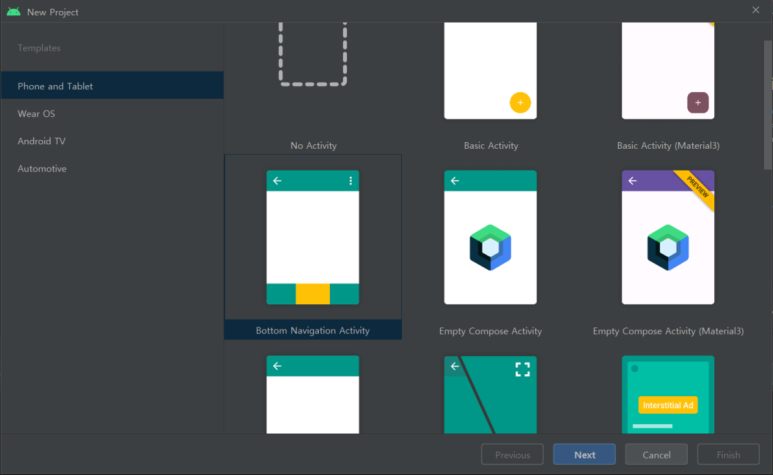
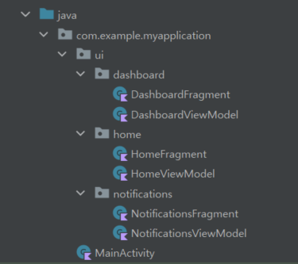
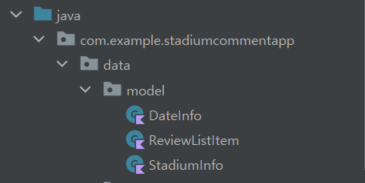

\* 과거에 제가 네이버 블로그에 작성했던 글을 가져왔습니다.

인턴을 마치고 이전부터 안드로이드 앱으로 만들어보고 싶었던 프로젝트를 시작했다.

프로젝트를 진행하면서 공부한 기술 스택들을 정리해 보려고 한다.

사실 어느 정도 프로젝트를 진행한 상태에서 블로그 글을 쓰고 있어서 앞으로 쓰는 내용에서 코드가 중간중간 빠져있을 수도 있고, 주제와 관련 없는 다른 내용이 막 섞여있을 수도 있을 것 같다.

<br>

아무튼 첫 번째 주제는 ViewModel 활용하기이다.

이전에 안드로이드 앱을 개발할 때에는 Activity나 Fragment 클래스에 무작정 모든 코드를 다 넣는 방식으로 코딩을 했다.

이렇게 하면 Activity와 Fragment가 거대해지고,

(더 복잡한 앱을 개발하다 보면 코드가 엄청 길어지고 복잡해질 것이다.)

결국 코드의 유지 보수가 어려워질 것이다.

그래서 App Achitecture라는 것이 필요하고, MVVM을 적용해 보기로 했다.

(이를 구현하기 위해 ViewModel을 활용하고자 한다!)

<br>

우선 MVVM의 개념을 간단히 정리해 보자면

MVVM - Model, View, ViewModel의 약자이다.

1. Model에서는 데이터를 준비한다. (예를 들어 DB API 등을 관리하는 역할)

2. ViewModel에서는 데이터를 읽고 수정하는 일들을 처리한다.

3. View에서는 UI에 데이터를 띄워주는 역할을 한다.

즉, ViewModel에서는 데이터를 읽고 수정하고,

View의 역할을 하는 Fragment나 Activity에서는 ViewModel의 데이터를 observing 하고 있다가 변화가 감지되면 이를 UI에 적용하는 방식이다.

<br>

이것저것 자료를 찾아보고 안드로이드에서 제공하는 ViewModel을 활용하여 MVVM의 ViewModel로 사용하고자 했다. (아래는 ViewModel에 대한 내용을 정리한 Android Developers 문서이다.)

- https://developer.android.com/topic/libraries/architecture/viewmodel?hl=ko

사실 이 ViewModel은 이전에 Bottom Navigation이 구현되어 있는 프로젝트를 만들 때 기본으로 구현되어 있는 것을 본 적이 있었다.(하지만 그때는 제대로 사용하지 못했다.)


이번 프로젝트도 기본으로 제공되는 형태의 하단 탭을 사용하기 위해서 Bottom Navigation Activity로 기본 프로젝트를 생성했다.

아래 사진처럼 처음 프로젝트를 생성할 때 Bottom Navigation Activity를 클릭하고 Next를 눌러서 프로젝트를 생성하면 



아래와 같이 각 탭에 대한 pakage가 생성되고, 그 아래에 Fragment와 ViewModel 클래스가 만들어진다.



여기서 각 클래스의 코드를 확인해 보면 ViewModel에서 text를 설정하고, Fragment에서 이를 관찰하여 화면에 띄우는 방식으로 구현이 되어있다. (사실 이것이 ViewModel을 활용하는 방식이다.)

아무튼 이것은 가장 처음에 기본적으로 만들어지는 형태이고,

이 코드를 기반으로 나의 프로젝트에 맞게 일단 탭의 이름을 바꾸고 수정을 해주었다.

(아래부터는 이번 프로젝트의 코드를 가져왔다.)

<br>

우선 ViewBinding을 활용하기 위해서 gradle 설정을 해주었다.

module 단의 gradle 파일에 다음의 코드를 추가했다.
```gradle
android {
    ...
    buildFeatures {
        viewBinding true
    }
}
```

- https://developer.android.com/topic/libraries/view-binding?hl=ko

ViewBinding 관련한 자세한 내용은 위의 링크에서 확인할 수 있다.

<br>

각 탭마다 방식은 같기 때문에 Home 탭의 코드를 가지고 기록을 해보려 한다.

Home 탭에서 내가 설정한 관심 있는 경기장의 정보를 띄워주는 부분이 있다. 이 부분의 데이터를 띄우는 방식을 예시로 작성을 해보고자 한다.



우선 프로젝트 파일 아래 data 패키지를 만들고, model 패키지 아래에 StadiumInfo라는 data class를 만들었다.

```kotlin
data class StadiumInfo(
    val stadiumName: String,
    val stadiumAddress: String,
    val stadiumPhone: String
)
```

HomeViewModel에서는 다음과 같이 변수와 함수들을 정의해 주었다.

```kotlin
@HiltViewModel
class HomeViewModel @Inject constructor(): ViewModel() {

    ...

    private val _interestStadium = MutableLiveData<StadiumInfo>()
    val interestStadium: LiveData<StadiumInfo> = _interestStadium

    ...

    fun loadInfo() {
        _interestStadium.value = StadiumInfo("수원 KT 소닉붐 아레나", "주소", "전화번호")
    }

    ...
}
```

ViewModel에서는 _interestStadium의 value를 설정해 주고,

(원래는 DB에서 값을 가져와야 하지만 일단은 dummy data를 넣어주었다.)

이후 Fragment에서는 아래와 같이 LiveData 타입인 interestStadium을 observe 하는 형태이다.

```kotlin
@AndroidEntryPoint
class HomeFragment : Fragment() {

    private lateinit var homeViewModel: HomeViewModel
    private var _binding: FragmentHomeBinding? = null
    private val binding get() = _binding!!

    ...

    override fun onCreateView(
        inflater: LayoutInflater,
        container: ViewGroup?,
        savedInstanceState: Bundle?
    ): View? {
        homeViewModel = ViewModelProvider(this)[HomeViewModel::class.java]
        _binding = FragmentHomeBinding.inflate(inflater, container, false)

        return binding.root
    }

    override fun onViewCreated(view: View, savedInstanceState: Bundle?) {
        super.onViewCreated(view, savedInstanceState)
        loadData()
        renderUi()
        observe()
    }

    private fun loadData() {
        homeViewModel.loadInfo()
        ...
    }

    private fun renderUi() {
        ...
    }

    @SuppressLint("SetTextI18n")
    private fun observe() {
        with(homeViewModel) {
            ...
            interestStadium.observe(viewLifecycleOwner, Observer {
                binding.stadiumName.text = it.stadiumName
                binding.stadiumAddress.text = it.stadiumAddress
                binding.stadiumPhoneNum.text = it.stadiumPhone
            })
            ...
        }
    }

    override fun onDestroyView() {
        super.onDestroyView()
        _binding = null
    }
}
```

(다른 변수들에 대한 코드들은 ...으로 생략해서 적어놓았다.)

HomeFragment의 observe 함수에서는 위에서 ViewModel에 정의한 interestStadium 변수를 observe 하고,

변수의 값이 변한 것이 감지되면 경기장 정보를 띄우는 TextView의 text 값을 바꾸어 화면에서 내가 관심 있는 경기장 정보를 확인할 수 있도록 했다.

​<br>

이렇게 안드로이드에서 제공하는 ViewModel과 LiveData를 활용하여 데이터를 로드하는 부분은 ViewModel에서 담당하고, Fragment에서는 UI와 관련된 작업들만 할 수 있도록 구현할 수 있다.

이렇게 함으로써 코드의 복잡도도 줄일 수 있고, 나중에 코드를 다시 확인하거나 수정이 필요한 경우에도 더 쉽게 처리할 수 있을 것 같다.
