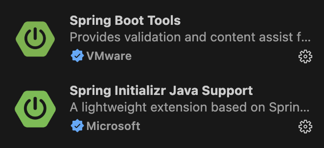
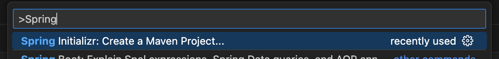
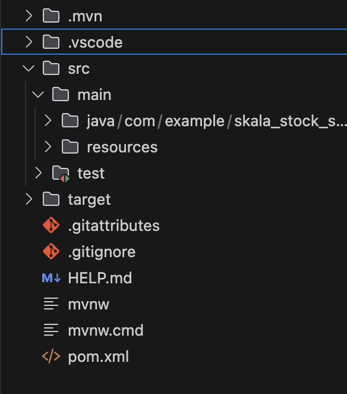

첫 백엔드 개발을 경험해보았습니다.

그래서 SKALA 백엔드 과정에서 진행했던 간단한 주식 서비스 프로젝트를 단계별로 복습하면서 정리해나가보려고 합니다.

Java 공부를 하고 이어서 백엔드를 시도해보는거라 JAVA와 스프링부트로 프로젝트를 개선해나가는 부분을 

### 스프링부트 프로젝트 만들기
우선 vscode IDE를 활용해서 개발을 진행했습니다.

프로젝트 만들기에 앞서서 편의를 위해서 몇 가지 extention들을 깔아주었습니다.



우선 이 두 가지를 깔아주었습니다. (Java 관련 extention은 이미 깔려있는 상태였음!)



그럼 vscode 커맨드 팔레트에서 Spring Initializr가  뜨는 걸 확인할 수 있고, 저는 Maven Project로 생성을 진행했습니다.

Spring Initializr를 선택하면 이어서 스프링부트 버전, 언어, Group Id, Artifact Id, Package Type, Java Version, Dependencies를 설정하도록하는 창이 순서대로 나타납니다.

아래처럼 기본 세팅을 해주었습니다.
|||
|---|---|
|Spring Boot Version|3.4.3|
|Language|Java|
|Group Id|com.example (default)|
|Artifact Id|이름 설정|
|Package Type|Jar|
|Java Version|17|


이렇게 세팅을 해준 후 dependency는 

- Spring Web
- Lombok
- Spring Boot DevTools

를 기본으로 설정해주었습니다. (dependency는 프로젝트 진행하면서 pom.xml에 계속 추가가 가능하기 때문에 필요한게 생기면 더 추가해주면 됩니다!)

저장 위치까지 지정해주면 스프링 부트 프로젝트가 바로 생성됩니다.

기본 프로젝트의 폴더 구조를 살펴보면 아래 사진처럼 구성되는 것을 확인할 수 있습니다.



src/main/java/com/example/프로젝트이름 폴더 아래에 있는 SpringBootApplication Java 파일을 실행시키면 스프링부트 프로젝트가 성공적으로 실행되는 것을 확인할 수 있다.


이렇게 실행되었다는 로그가 뜨면 성공적으로 실행이 되었다는 의미이다.

### IDE Formatting 설정
마지막으로 코드 포매팅을 위한 IDE 설정을 추가하려고 합니다.

프로젝트 폴더 중 .vscode 폴더에 들어가면 settings.json 파일을 찾을 수 있습니다.

해당 파일에 아래와 같은 코드를 추가 하면 저장을 하는 순간 vscode에서 자동으로 코드 formatting을 해주는 것을 확인할 수 있다.

```json
{
  "java.compile.nullAnalysis.mode": "automatic",

  "java.format.settings.url": "eclipse-formatter.xml",
  "editor.formatOnSave": true, // 저장할 때 코드 포맷 자동 정리
  "editor.codeActionsOnSave": {
    "source.organizeImports":"always" // 필요한 클래스 import 문장 자동 추가/삭제
  },
  "[java]": {
    "editor.tabSize": 4, // 탭 크기 설정 (기본값 4)
    "editor.insertSpaces": true, // 탭 대신 공백 사용
    "editor.formatOnSave": true // 저장 시 자동 포맷팅
  },
  "java.configuration.updateBuildConfiguration": "interactive"
}
```

이제 스프링부트 프로젝트를 개발하기 위한 준비가 완료되었습니다!
