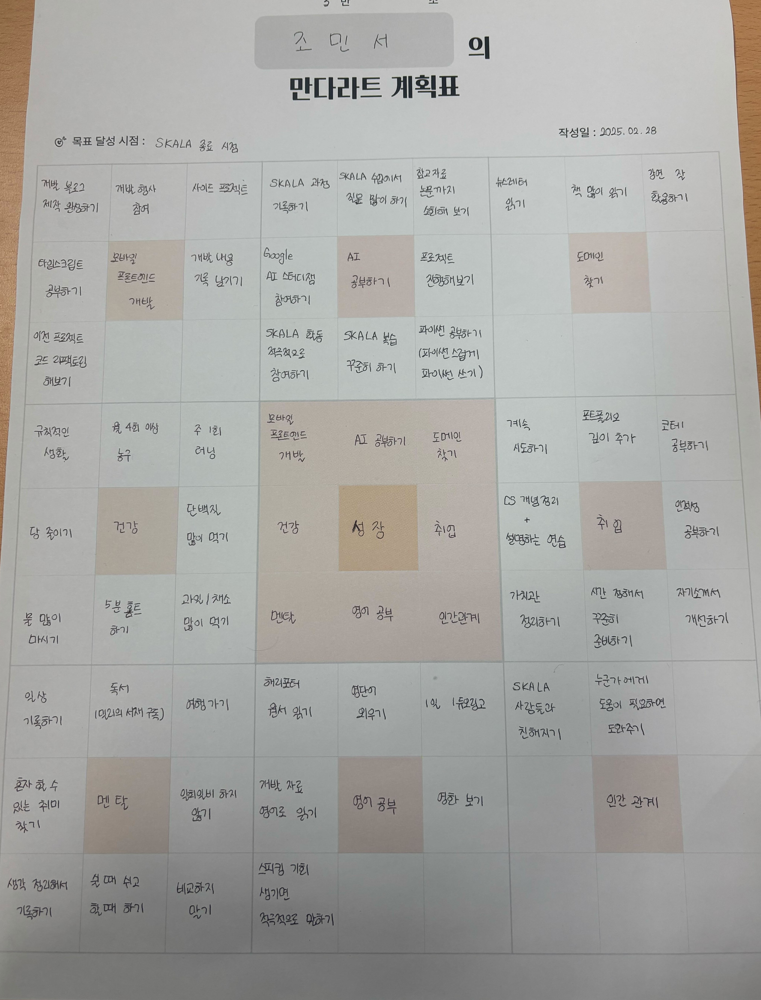
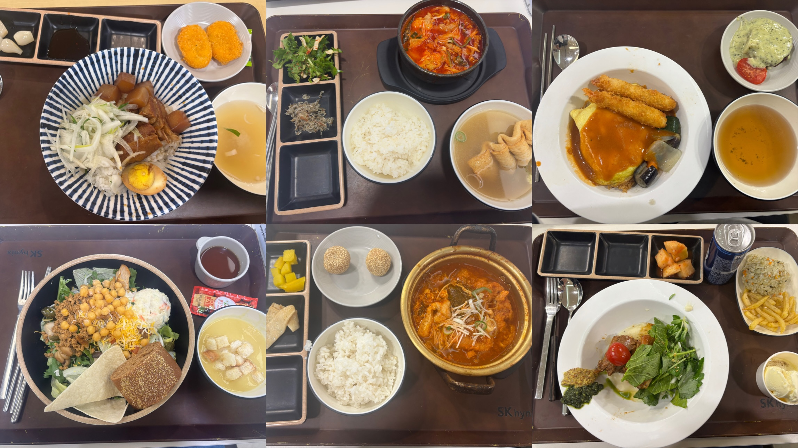
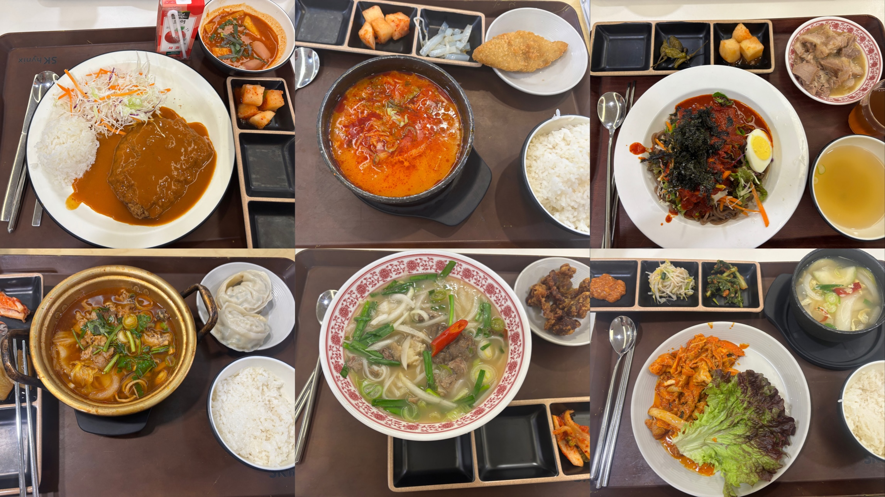
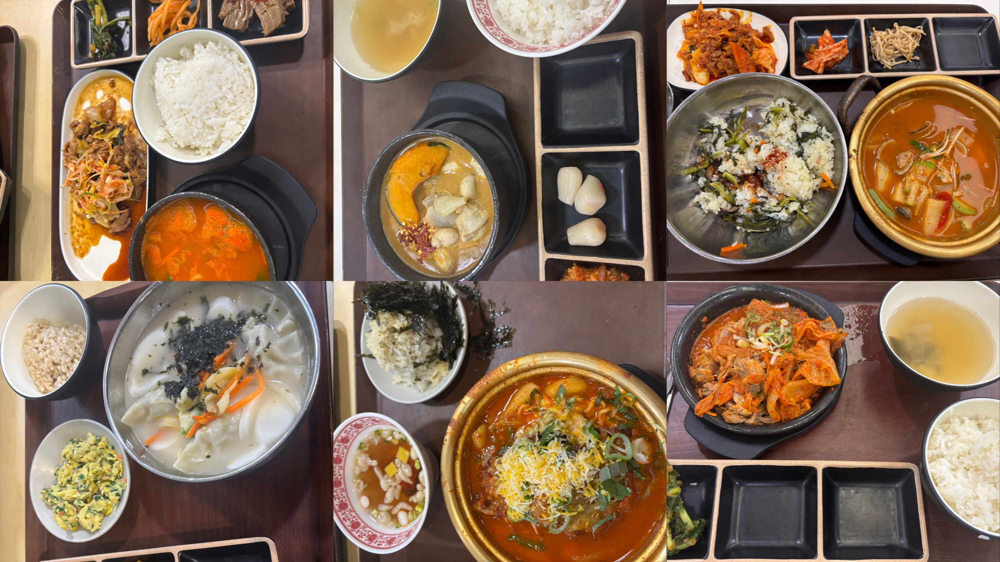

3월 첫 주에 Java, SpringBoot 수업을 들으면서 실습한 내용들을 블로그에 정리해보면 좋겠다는 생각에 묵혀두었던 블로그를 금요일에 다시 꺼내보았다.

그런데 마침 4월 이벤트로 포트폴리오 이벤트를 진행한다고 해서 방치되었던 블로그를 가꿔 보기로 다짐했다. (글도 쓰는 동시에 이것저것 디자인도 수정하고, 반응형으로 수정, 태그, 댓글 기능 추가 등등 기능 추가도 빠르게 해봐야겠다.)

아무튼 앞으로 SKALA에서 공부한 내용들을 잘 정리해서 기록해보려고 합니다.

첫 글로 무슨 내용을 쓸까 고민하다가 노션에 정리했던 2월 회고를 남겨봐야겠다고 생각했다.

### SKALA 소개
일단 SKALA 첫 회고 글이니까 SKALA에 대해서 간단히 소개하면

>SK C&C 채용연계형 AI 서비스 개발 과정

이다.

교육 과정이나 다양한 혜택에 관련된 내용은 아래 사이트에서 찾아볼 수 있다.

https://skala.co.kr/

과정은 SW Fundamental, Data AI, AI Team Project, 특강으로 이루어져 있다.

기초 SW 관련 내용과 데이터분석, AI관련 강의를 우선 진행하고 이후에 프로젝트를 진행하는 형식으로 진행된다.

### 2월 교육 회고
2월은 주로 클라우드와 데이터분석 기초 주제들에 대한 강의들을 들었다.(공부한 구체적인 내용에 대해서는 앞으로 조금씩 정리를 해보려고 한다.)

오랜만에 하루에 8시간씩 강의를 듣는거라 처음에는 조금 피곤했었는데 이제는 조금 익숙해졌다.

2월에 들었던 강의 중에 가장 기억에 남았던 내용은 생성형 AI 관련 강의였던 것 같다. 이전에 다른 곳에서 배우거나 다뤄본 적 없는 새로운 내용이라서 더 흥미로웠다. (드디어 그 유명한 Transformer에 대한 큰 흐름과 그림을 그릴 수 있었다..!)

2월 강의를 들으면서 가장 크게 느낀건 큰 흐름과 구조를 잘 정리하면서 공부를 해야겠다는 것이었다. 사실 학교 수업에서 클라우드 관련 수업을 들으면서 컨테이너, 쿠버네티스 관련 부분이 큰 그림이 잘 그려지지 않아서 조금 어려웠는데, SKALA에서 다시 내용을 들으면서 큰 그림을 그릴 수 있게 되었다. (+ 특히 같은 조원들이랑 대화하면서 수업 내용에 대해서 이야기 나누는 시간을 가졌던 것이 가장 큰 도움이 되었다. 그리고 조원분들이 질문을 많이 해주셨는데, 답변을 고민하고 표현해보니까 확실히 더 이해하는데 도움이 되었다. 이 자리를 빌어 감사인사를 전합니다 ☺️)

수료생이 된 이후에 작년 하반기에는 주로 혼자 공부를 했는데, 다른 사람들이랑 같이 공부하는게 확실히 더 재밌는 것 같다!

2월 마지막 특강 날에는 만다라트 만들기를 하면서 목표와 계획을 작성하는 활동도 진행했는데, 뭔가 나를 한 번 돌아보고 계획하는 시간이라 J 인간에게 매우 흥미로운 시간이었다.

구체적으로 쓰다보니까 생각보다 81개의 칸을 채우는 건 쉽지 않았다... 뭔가 실제 해야겠다고 생각한 내용들로 잘 채워보려고 했는데, 채우다보니 할 일이 정말 많다는 것을 깨달았다. 하나하나 차근차근 잘 지워나가보겠습니다!

아무튼 SKALA 과정을 시작하고 엄청 바빠졌다.(내맘대로 자유롭게 시간 쓰던 시절은 끝났으요..) 2월 한 달 지내보면서 시간 관리를 좀 잘해야겠다는 생각이 가장 크게 들었다.

하루에 두시간 반 정도 지하철에서 시간을 보내다보니까 시간 활용을 잘 할 수 있는 방법에 대해서 고민이 되기 시작했다.(통근, 통학하는 분들 존경합니다...)

2월 회고는 점심 사진들로 마무리!

