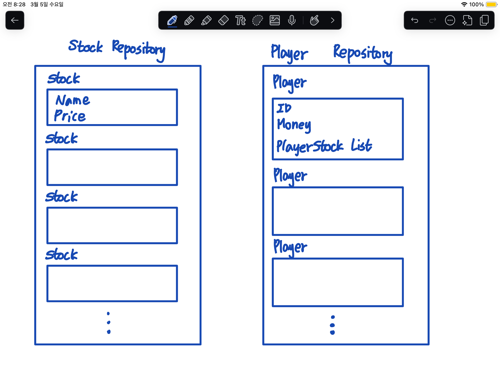

스프링부트 코드를 정리하기 전에 주식 서비스 프로젝트가 어떤 식으로 이루어져 있는지 정리하는 과정이 필요해서 이 부분을 먼저 정리해보려 합니다.

SKALA 과정에서 Java와 SpringBoot를 이어서 배웠기 때문에 Java 실습에서 진행했던 콘솔 주식 서비스 코드를 활용하여 SpringBoot로 옮겨서 리팩토링 하는 과정을 거쳤습니다.

그래서 일단 콘솔 주식 서비스를 기반으로 서비스의 큰 구조와 기능들을 정리해보았습니다.

### Java console 주식 서비스 분석

#### 기능 정리

우선 기본 기능들을 정리해보면 아래와 같습니다.

    1. 사용자 등록
        - 아이디를 입력 
        - 아이디가 이미 존재하는 경우 → 해당 아이디로 로그인 됨
        - 아이디가 없는 경우 → 초기 자금을 입력 받은 후 새 사용자 출력
    2. 보유주식 확인
        - 남은 금액과 보유주식 확인 가능
    3. 주식 구매
        - 주식 목록 파일에 있는 주식을 구매하는 기능
    4. 주식 판매 
        - 내가 보유한 주식을 판매하는 기능


이 기본 네가지 기능에 추가하여 크게 아래의 두 가지 기능을 추가했습니다.


    1. admin 기능 추가
        - 주식 등록
            - 새로운 주식 종목을 등록하는 기능
        - 주식 삭제
            - 등록된 주식 종목을 삭제하는 기능
    2. 주식 가격 갱신
        - 특정 주기로 주식 가격을 랜덤으로 갱신 (변동 폭은 현재 주식 가격 기준으로 30% 이내)

#### 코드 구조 정리
SKALA 수업을 진행하며 교수님께서 주신 기본 코드를 바탕으로 기능 추가를 진행했습니다.

일단 기본적인 코드의 흐름은 아래에서 확인할 수 있습니다.



데이터의 구조를 중심으로 구조를 우선 살펴보면

주식 데이터를 관리하는 Stock 클래스가 존재하고 StockRepository에서 이 Stock의 리스트를 관리하는 역할을 합니다.

사용자 데이터는 Player 클래스를 활용하여 관리를 하게 되고,

Stock 클래스를 상속받은 PlayerStock의 리스트를 Player 내에서 관리하여 사용자의 보유 주식을 처리할 수 있도록 했습니다.

주식 데이터와 마찬가지로 PlayerRespository가 존재하고, 사용자 데이터를 관리하는 역할을 합니다.

```bash
├── /data
│   ├── players.txt // 사용자 데이터 저장소
│   └── stock.txt   // 주식 데이터 저장소
└── /src
		├── App.java    // 서비스 실행
		├── Player.java // 사용자 데이터 클래스
		├── PlayerRepository.java  // 사용자 데이터 관리
		├── PlayerStock.java // 사용자 보유 주식 데이터 클래스
		├── SkalaStockMarket.java. // 전체 서비스 UI 입출력 처리
		├── Stock.java   // 주식 데이터 클래스
		└── StockRepository.java  // 주식 데이터 관리
```

이런식으로 프로젝트를 구성했습니다.

Database 없이 모든 데이터를 txt 파일에 저장하고 읽어오는 방식으로 진행을 했습니다.

### Java console 주식 서비스 수정과정
추가 기능을 위해 주어진 코드를 수정한 과정을 조금 정리해보고자 합니다.

#### Admin 기능 추가
우선 전체 서비스의 UI를 처리하는 SkalaStockMarket에서 admin 모드와 사용자 모드를 추가해주었습니다.

```java
public void start() {
	...생략...
	
	// 프로그램 시작
	System.out.print("플레이어 ID를 입력하세요: ");
	String playerId = scanner.nextLine();
	
	Boolean isAdmin = false;
	
	if(playerId.equals("admin")) { // 관리자인 경우
	    isAdmin = true;
	} else {
	    player = playerRepository.findPlayer(playerId);
	    if (player == null) { // 새로운 플레이어
	        player = new Player(playerId);
	
	        System.out.print("초기 투자금을 입력하세요: ");
	        int money = scanner.nextInt();
	        player.setPlayerMoney(money);
	        playerRepository.addPlayer(player);
	    }
	    displayPlayerStocks();
	}
	
	if(isAdmin) {
	    startAdminMode(scanner);
	} else {
	    startPlayerMode(scanner);
	}
	
	...생략...
}
```

Admin 기능은 입력한 플레이어 ID가 `"admin"`인 경우에 작동하게 했습니다. (다른 비밀번호 확인 처리는 없는 로직을 구현했는데, 이후에 추가하면 좋을 것 같다는 생각이 들었습니다.)

원래 코드는 ID를 입력 받은 후에 프로그램이 돌고 사용자 UI를 위한 부분을 `start()` 함수 내에서 모두 처리하고 있었지만 Admin을 추가하면서 함수를 분리시켜줬습니다.

이런식으로 기존에 있던 사용자 모드와 비슷하게 Admin 모드 함수를 작성해줬습니다.

```java
// 관리자 모드 실행
private void startAdminMode(Scanner scanner) {
    boolean running = true;
    while (running) {
        System.out.println("\n=== 스칼라 주식 프로그램 관리자 메뉴 ===");
        System.out.println("1. 주식 목록");
        System.out.println("2. 주식 추가");
        System.out.println("3. 주식 삭제");
        System.out.println("0. 프로그램 종료");

        System.out.print("선택: ");
        int code = scanner.nextInt();
        scanner.nextLine(); // 개행 버퍼 삭제

        switch (code) {
            case 1:
                displayStockList();
                break;
            case 2:
                addStock(scanner);
                break;
            case 3:
                deleteStock(scanner);
                break;
            case 0:
                System.out.println("프로그램을 종료합니다...Bye");
                running = false;
                break;
            default:
                System.out.println("올바른 번호를 선택하세요.");
        }
    }
}
```

> 개행 버퍼 삭제하기
이 코드를 작성하면서 유의해야할 점은 입력값을 받을 때, 개행 문자 처리를 해줘야하는 것이었습니다.

메뉴 선택 입력을 nextInt()로 받는 경우에 입력할 때 enter키를 치게 되면 입력한 숫자는 code 변수에 저장되고, 개행문자(\n)는 입력 버퍼에 남아있게 됩니다.

이때, addStock()과 같은 함수에서 새로운 주식 이름과 가격을 nextLine()을 활용하여 입력받게 되는데, 이때 버퍼에 남아있던 개행 문자 때문에 입력을 제대로 받지 못하는 문제가 생겼습니다. 이를 방지하기 위해 int값을 받은 후에 nextLine()을 한 번 호출하여 개행 문자를 버퍼에서 삭제해줄 수 있도록 했습니다.

관리자 기능을 추가하면서 가장 고려했던 사항은 각 클래스에 관련 함수를 추가하면서 확실히 각각의 기능을 분리하는 것이었습니다.

    - SkalaStockMarket: 콘솔 UI 관련한 내용 처리
    - StockRepository: 데이터를 파일에 저장 및 읽어오는 함수들 관리
    - Stock: 데이터 클래스 역할

이런 식으로 구분을 하고, 역할을 계속 염두에 두며 코드를 작성했습니다.

#### 주식 가격 실시간 업데이트 기능 추가

Timer와 TimerTask를 활용하여 해당 기능을 추가해줬습니다.

```java
private void start() {
    ...생략...

    // 가격 변동 업데이트 위한 타이머
    Timer timer = new Timer();

    TimerTask task = new TimerTask() {
        @Override
        public void run() {
            stockRepository.changeRandomStockPrice();
            stockRepository.saveStock();
        }
    };

    timer.scheduleAtFixedRate(task, 10000, 10000);

    ...생략...

    timer.cancel();
}
```

이런식으로 `start()` 함수에 타이머를 설정하여 프로그램이 실행되는 동안 특정시간 주기로 주식 가격을 업데이트 할 수 있도록 했습니다.

우선 새 `Timer` 객체를 정의하고 주기적으로 실행하고 싶은 task를 `TimerTask` 객체로 만들어줍니다.

이후 이 task를 `scheduleAtFixedRate()`에 넘겨주면 해당 task를 설정한 주기마다 실행할 수 있게 됩니다.

새로운 주식 가격을 설정하는 함수는 아래와 같이 구성했습니다.

```java
// stock 가격 random update
public void changeRandomStockPrice () {
    for(Stock stock: stockList) {
        double percent = (Math.random() * 0.6) - 0.3;   // -0.3 ~ 0.3
        BigDecimal total = new BigDecimal(stock.getStockPrice() + (stock.getStockPrice() * percent)).setScale(2, RoundingMode.DOWN);
        stock.setStockPrice(Double.parseDouble(String.format("%.2f", total)));
    }
}
```

> double 자료형 처리
여기서 문제가 되었던 부분은 double 자료형 관련하여 처리를 해주어야 했던 부분입니다.

주식의 가격을 double 자료형으로 정의하고 진행을 하였는데 이 과정을 진행하며 주식 가격의 소수점 아래의 형태가 아래와 같이 나타나는 문제가 발생했습니다.

```
실제 원하는 값: 0.1
double 값: 0.10000000000000002
```

컴퓨터 내에서 실수를 이진수를 표현하는 과정에서 부동소수점 오차가 발생하여 이러한 현상이 발생하게 됩니다.

이 부분을 해결할 수 있는 부분은 여러가지가 있는데, 

저는 다음과 같은 방법으로 진행했습니다.

  - 연산을 할 때에는  BigDecimal을 이용하여 계산 결과에서 오차가 발생하지 않도록 진행
  - 저장시에는 String으로 변환하여 포맷을 맞춰준 후 저장 (Stock 함수의 필드값의 자료형을 변경하지 않기 위해서 파일에 저장할 때에도 string 포맷을 한 번 맞춰주는 과정을 추가)

그런데 지금 정리를 하면서 돌아보니 Stock 함수의 필드값의 자료형 자체를 BigDecimal로 수정하는 방안이 더 정확한 연산을 진행할 수 있는 방안이라는 생각이드네요….

아무튼 이후 SpringBoot로 해당 프로젝트를 수정하는 과정에서는 조금 더 쉬운 관리를 위해서 int형으로 자료형을 수정해서 진행하였습니다.

### 정리
그래서 정리를 해보면 위의 Java 코드에 있는 아래 기능들을 바탕으로

    - 사용자 관련 기능
        - 사용자 등록
        - 사용자 삭제
        - 사용자 조회
        - 주식 구매
        - 주식 판매
    - 주식 관련 기능
        - 주식 등록
        - 주식 삭제
        - 주식 조회

SpringBoot 프로젝트에서 각 기능을 하는 API를 만들어보고자 합니다.