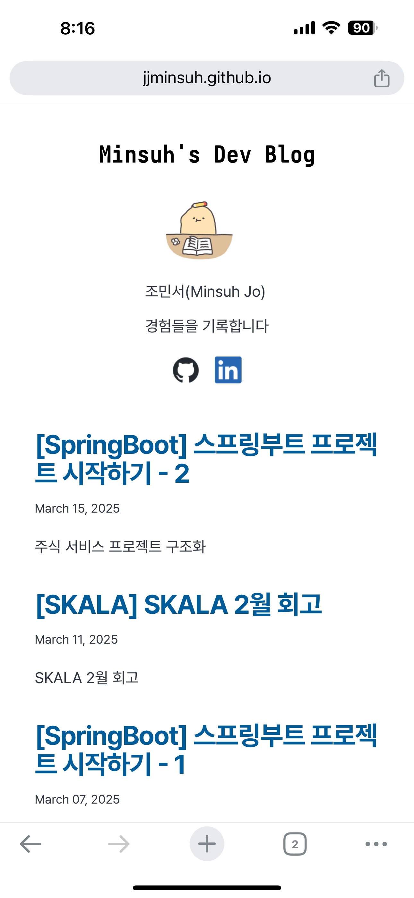
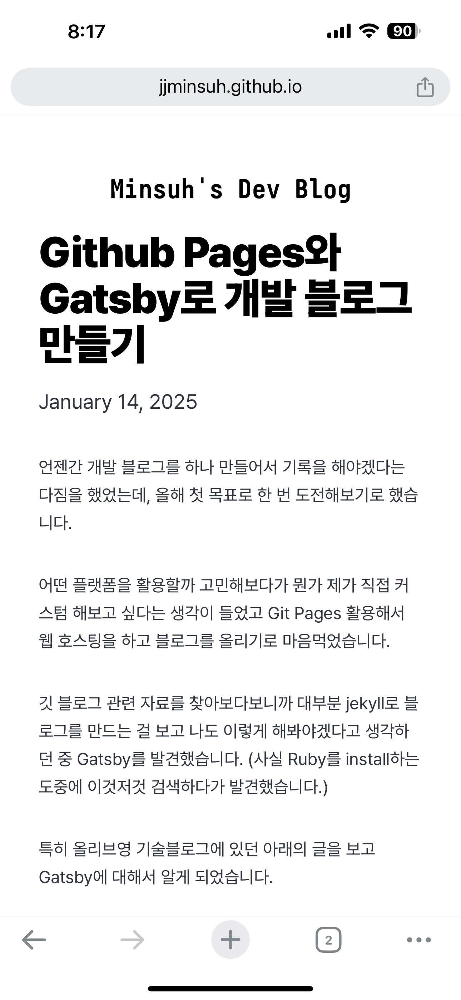
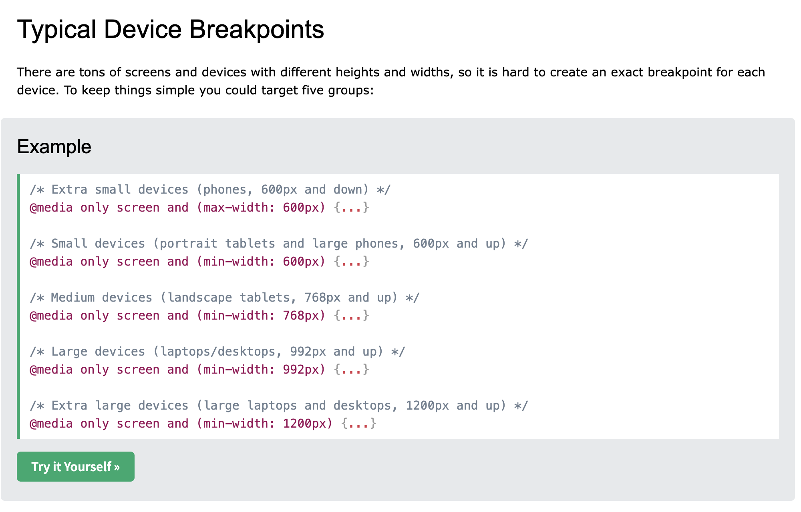
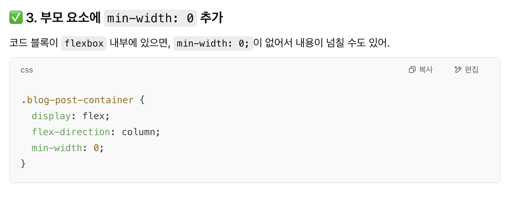

SKALA 포트폴리오 이벤트에 블로그를 제출하려고 보니 모바일 화면에서 레이아웃이 무너져 있는 것을 발견했습니다. 기본 Gatsby 블로그 레이아웃에 사이드바를 추가하면서 반응형 처리를 하지 않은 것이 문제였습니다.

그런데 마침 프로그래밍 기초 과정에서 CSS media 쿼리에 대한 내용을 배웠고, 바로 적용해보자고 마음먹고 수정을 진행했습니다.

사이드 바를 도입할 때 사이드 바의 크기를 픽셀로 고정하고 남은 자리에 블로그 글(또는 목록)을 채울 수 있는 방식으로 구현했는데, 화면이 작아지는 경우 블로그 글에 할당되는 화면 크기가 너무 작아지는 것이 문제였습니다. (아쉽지만 무너진 레이아웃 캡쳐 화면이 없네요…)

### media query 적용하기
우선 큰 그림을 그려보면 화면의 가로 크기가 작아지는 경우에는
1. 홈에서는 프로필 정보를 블로그 글 목록 위쪽에 위치하도록
2. 포스트 페이지에서는 프로필 정보가 보이지 않도록
설정하고자 했습니다.

|
---|---|


media 쿼리를 사용하는 방법은 아래와 같습니다.
```css
@media (조건) {
  내용
}
```

조건에 해당하는 경우에는 원래 정의했던 css가 아니라 `내용`부분에 해당하는 css가 적용됩니다.

대체로 사용하는 media 쿼리의 break point를 w3schools에서 찾아보았습니다.



저는 medium 디바이스 기준으로 작은 화면과 큰 화면을 나누기로 했고, 아래처럼 조건에 `max-width: 768px`를 넣어주었습니다.

수정한 style.css 파일을 보면 다음과 같습니다.

```css
@media (max-width: 768px) {
  .global-wrapper {
    flex-direction: column; /* 세로 정렬로 변경 */
    align-items: center;
  }

	/* 세로 정렬로 변했을 때, margin 조정 */
  .global-header {
    margin-bottom: var(--spacing-0);
  }
	
	/* 홈 페이지가 아닌 경우 프로필 숨기기 */
  .global-wrapper[data-is-root-path="false"] .bio {
    display: none;
  }
	
	/* 세로 정렬로 변했을 때, margin 조정 */
  .global-wrapper[data-is-root-path="false"] .global-header {
    margin-top: var(--spacing-4);
    margin-bottom: var(--spacing-6);
  }
	
	/* 세로 정렬로 변했을 때, margin 조정 */
  .global-wrapper[data-is-root-path="true"] .bio {
    margin-bottom: var(--spacing-2);
  }
	
	/* 세로 정렬로 변했을 때, margin 조정 */
  .bio {
    display: flex;
    flex-direction: column;
    align-items: center;
    margin-top: var(--spacing-2);
    margin-bottom: var(--spacing-2);
  }
	
	/* 프로필 이미지 크기 조정 */
  .bio-avatar {
    min-width: 50px;
    border-radius: 100%;
  }

	/* 세로 정렬로 변했을 때, margin 조정 */
  .bio-name {
    margin-top: var(--spacing-2);
  }
	
	/* 세로 정렬로 변했을 때, margin 조정 */
  .sidebar-wrapper {
    margin-bottom: var(--spacing-0);
    padding: 0 20px;
    display: flex;
    flex-direction: column;
    align-items: center;
    width: 280px;
    min-width: 280px;
  }
	
	/* 목차를 위해 확보했던 padding 제거 */
  .post-content {
    padding-right: var(--spacing-0);
  }
}
```

### 코드 블럭 잘리는 문제 처리
media 쿼리 처리를 추가하면 바로 문제를 해결할 수 있을 줄 알았지만 특정 글들이 화면 안에 들어오지 않고 잘리는 문제가 발생했습니다.

모든 글이 아니라 특정 글에서만 문제가 발생해서 원인을 찾던 중 코드 블럭이 있는 글에서 문제가 발생한다는 사실을 찾았습니다.

챗 지피티에게 도움을 요청하던 중 이 답변을 보고 제가 전체 글을 감싸는 div를 추가했었다는 사실을 깨달았습니다.

*chat gpt 답변*

부모 div의 width를 설정하지 않았던 것이 문제의 원인이었습니다.

```css
.main-wrapper {
  width: 100%;
  padding: var(--spacing-0) var(--spacing-4);
}

.post-wrapper {
  display: flex;
  align-items: flex-start;
  width: 100%;
  max-width: 980px;
}
```
글을 감싸고 있는 wrapper의 width를 설정해줬더니 문제가 해결되었습니다!

#### \[참고\] 왜 이런 일이 발생하는가?
`<div>`의 `width`를 설정하지 않으면 default 값으로 `auto`가 지정됩니다.

`width: auto;` 의 경우에는 내부 요소에 따라 크기가 결정되지만

`width: 100%;` 의 경우에는 내부 요소에 상관없이 강제로 부모 요소의 너비만큼 강제로 채우게 됩니다.

그래서 auto를 사용하는 경우에는 위의 문제상황처럼 내부의 코드 블럭 박스가 화면의 크기보다 큰 경우에 내부 컨텐츠가 잘릴 위험이 있습니다.

코드 블럭 내부의 text의 overflow 설정은 활용하고 있는 markdown 변환 플러그인에서 자동으로 스크롤이 되도록 설정해주었기 때문에 따로 설정할 내용은 없었습니다.