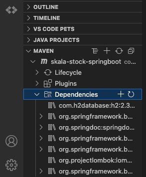
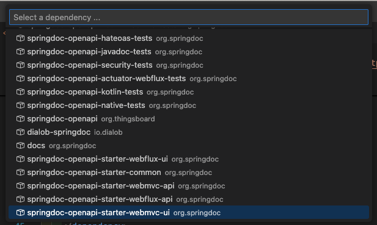
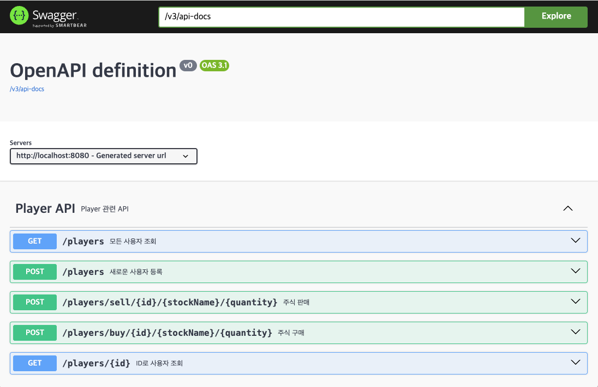
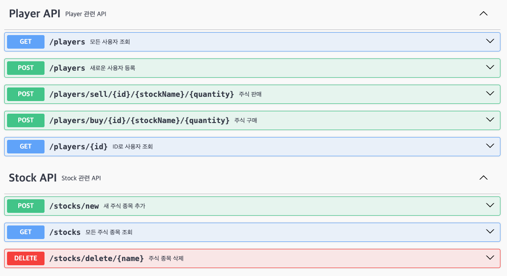

앞선 글에서 정리했던 Java Console 주식 서비스의 기능들을 구현하기 위한 API를 구상해보았습니다.

그리고 이를 더 쉽게 보기 위해서 프로젝트에 Swagger를 추가하여 조금 더 쉽게 요청을 테스트하고 확인할 수 있도록 했습니다.

우선 앞선 기능들을 정리하면 아래와 같습니다.

    - 사용자 관련 기능
        - 사용자 등록
        - 사용자 삭제
        - 사용자 조회
        - 주식 구매
        - 주식 판매
    - 주식 관련 기능
        - 주식 등록
        - 주식 삭제
        - 주식 조회

이 각각의 기능을 하나의 API로 설정하고자 했습니다. 

이를 바탕으로 이번 글에서는 Swagger를 설정하고 기본적으로 API를 정의하는 코드에 대해서 살펴보고자 합니다.

### 프로젝트에 Swagger 추가하기
우선 작업을 시작하기 전에 Swagger를 프로젝트에 추가하고자 했습니다.

https://swagger.io/

Swagger에 대한 공식 문서는 위에서 확인할 수 있습니다.

그럼 이제 본격적으로 프로젝트에 Swagger를 추가해보겠습니다.

#### Dependency 추가하기

저는 처음에 Maven으로 프로젝트를 설정했기 때문에 pom.xml 파일에 dependency를 추가해줬습니다.

pom.xml 파일에 아래 내용을 바로 추가해주는 것도 가능하고,
```xml
<dependency>
    <groupId>org.springdoc</groupId>
    <artifactId>springdoc-openapi-starter-webmvc-ui</artifactId>
    <version>2.4.0</version>
</dependency>
```

vscode를 사용한다면 IDE에서 dependency를 검색해서 추가하는 것도 가능합니다.



이렇게 vscode의 maven 툴에서 Dependencies 옆의 + 버튼을 누르면 아래와 같이 상단에 팔레트에서 dependency를 검색할 수 있습니다.



`springdoc` 으로 검색어를 입력하여 `springdoc-openapi-starter-webmvc-ui`를 선택해주면 됩니다.

직접 pom.xml 파일에 추가하는 방식은 최신 버전을 찾아서 직접 입력해줘야하는 반면에 두 번째 방식으로 진행하게되면 자동으로 pom.xml에 dependency를 추가할 때, 최신 버전으로 설정됩니다.

https://mvnrepository.com/artifact/org.springdoc/springdoc-openapi-starter-webmvc-ui

해당 dependency의 최신 버전은 여기서 확인할 수 있습니다.

#### swagger-ui 확인하기

위의 dependency 설정을 추가한 후에 스프링부트 프로젝트를 실행시키면 자동으로 `/swagger-ui/index.html` 엔드포인트가 생성되는 것을 확인할 수 있습니다.

```
http://localhost:8080/swagger-ui/index.html
```

그래서 이런식으로 내 프로젝트가 돌고 있는 서버 url에  `/swagger-ui/index.html`을 붙여주면 내 프로젝트의 api document를 확인할 수 있습니다.

*이미 API를 작성한 코드라서 아래에 API 목록이 뜨는 것을 확인할 수 있는데, 처음에는 빈 화면이 뜰 겁니다!*


### API 추가하기

이제 Controller에 API를 정의해보겠습니다. (큰 구조는 다음 글에서 다루고 제가 만들고자하는 API 리스트와 Swagger description 추가하는 부분 위주로 정리했습니다.)

우선 API는 Player API와 Stock API로 분류하여 총 두 개의 Controller를 정의했습니다.

Player API에서는 앞선 기능 목록 중 `사용자 관련 기능`을 정의했고, Stock API에서는 `주식 관련 기능`을 정의했습니다.

API 리스트는 아래 사진과 같습니다.



#### Controller 구성하기

이제 Controller 별로 API를 구분하고 설명을 작성하기 위해 annotaion을 추가해줬습니다.

`PlayerController`의 코드를 살펴보면 아래와 같습니다.

```java
...생략...
@RequestMapping("/players")
@Tag(name = "Player API", description = "Player 관련 API")
public class PlayerController {
	...생략...
}
```

- `@RequestMapping`

  PlayerController의 기본 url mapping은 `/players`로 잡아주었습니다.

  해당 controller에서 정의되는 API는 모두 `base_url/players`를 base로 가지도록 정의됩니다.

- `@Tag`

  controller에 `Tag` annotation을 추가하면 아래 사진처럼 Swagger UI에 해당 API에 대한 description을 추가할 수 있습니다.

  

#### API 정의하기

실제 API 정의는 다음과 같이 할 수 있습니다.

```java
@Operation(summary = "ID로 사용자 조회", 
           description = "ID를 받아 해당 사용자를 반환한다.")
@GetMapping("/{id}")
public ResponseEntity<PlayerDto> getPlayerById(@PathVariable String id) {
  try {
    PlayerDto response = playerService.getPlayerByPlayerId(id);

    if (response == null) {
      return ResponseEntity.notFound().build();
    }

    return ResponseEntity.ok(response);
  } catch (Exception e) {
    return ResponseEntity.status(400).build();
  }
}
```

위의 코드에서 확인할 수 있는 ID를 통해 사용자를 조회하는 API를 기준으로 정리를 해보겠습니다.

- `@Operation`

  ``` java
  @Operation(summary = "ID로 사용자 조회", description = "ID를 받아 해당 사용자를 반환한다.")
  ```

  이 Annotation은 Swagger UI에 해당 API의 설명을 추가해줍니다.

- `@GetMapping`

    ```java
    @GetMapping("/{id}")
    ```

    해당 Annotationadmf 통해 API의 method 및 url 설정해줄 수 있습니다. 여기서는 GetMapping으로 설정해주었으므로 GET method로 정의했음을 확인할 수 있고, url은 `/{id}`로 설정해주었기 때문에 PathVariable로 사용자의 id를 받아서 해당 id를 가진 사용자의 정보(`PlayerDto`)를 반환함을 확인할 수 있습니다.


이런 방식으로 annotation을 활용하여 다른 API들도 정의해주었습니다.

이번 글에서는 API를 정의하는 과정까지만 정리하고 다음 글에 이어서 전체 구조를 그리면서 스프링부트 프로젝트 내의 코드에 흐름에 대해서 정리해보겠습니다!